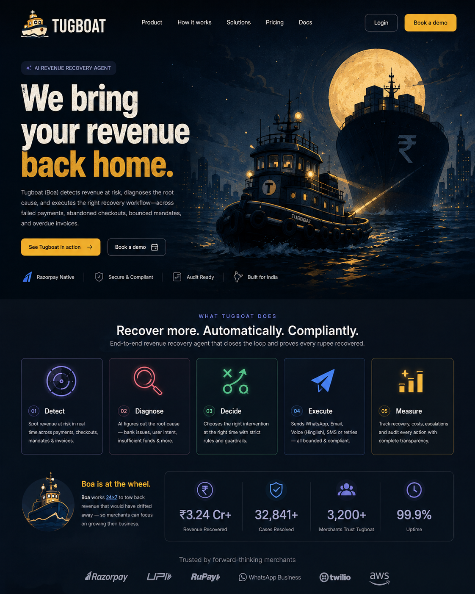

<p align="center">
  
</p>

<h3 align="center">We bring your revenue back home.</h3>

<p align="center">
  AI revenue recovery agent for Razorpay merchants — built for the
  <a href="https://razorpay.com/buildathon/">Razorpay AI Buildathon</a>, Track 03.
</p>

<p align="center">
  <a href="https://tugboat-six.vercel.app/"><b>Live demo</b></a> ·
  <a href="https://youtu.be/e0orCEB-_eE"><b>Video walkthrough</b></a> ·
  <a href="docs/ARCHITECTURE.md">Architecture</a> ·
  <a href="docs/evidence/README.md">Evidence</a> ·
  <a href="#what-broke-at-2-am-and-how-it-was-fixed">What broke at 2 AM</a>
</p>

---

When a payment fails, a checkout is abandoned, a mandate lapses or an invoice goes
overdue, Tugboat opens a case, diagnoses why, and works it back inside a policy a
merchant can read — quiet hours, attempt caps, cool-downs, opt-outs, approvals for
anything that spends money — with every action on a hash-chained ledger and every
claim in the evidence report computed from those rows. The agent at the wheel is
**Boa**; the governing sentence is: *the LLM proposes; the state machine and the
PolicyGate dispose.*

## The numbers (committed evidence, seed 42)

From [`docs/evidence/tugboat-batch-seed-42.json`](docs/evidence/tugboat-batch-seed-42.json) —
written by the running system across 214 synthetic cases and 10 simulated days,
reproducible from the seed:

| | |
|---|---|
| Recovered | **₹11,15,724 of ₹23,95,944 at risk — 46.6%** (107 of 214 cases) |
| Uplift vs no-agent baseline (13.5%) | **+33.0 points** on the identical population |
| vs the naive arm (contact everything) | naive recovers 2.6 points more — by sending **1,004 contacts vs 398**, with **501 quiet-hour violations vs 0** and 3× the complaints |
| Diagnosis vs hidden ground truth | 90.3% (rules table 93.8%, LLM lane 57.9% on the 19 hardest; 18 low-confidence cases escalated instead of guessed) |
| Compliance, computed from 3,088 ledger rows | 0 quiet-hour sends · 0 post-opt-out contacts · 0 cases past their cap · 0 unmasked identifiers |
| Cost | ~1 paisa per ₹100 recovered |
| Not recovered | 107 cases, each with its reason in the exceptions list |

The bar for Track 03 — *measured money recovered across a batch, with compliant
escalation, stopping rules, and an audit trail* — maps to: the Simulation Lab's
batch report, the Approvals queue, the PolicyGate, and the Audit Explorer's
browser-verifiable hash chain.

## Try it

The Control Tower is live at **<https://tugboat-six.vercel.app/>** — sign in with
`demo@tugboat.dev` / `tugboat-demo` or take the "Try the demo" door. The API runs on
Render's free plan, so the first hit after an idle spell can take ~60s to wake.
The video walkthrough is at **<https://youtu.be/e0orCEB-_eE>** — the deployed product,
page by page, on the same data the live demo narrates.

<details>
<summary>What it looks like</summary>
<p align="center"></p>
</details>

- `backend/` — NestJS 11 API, agent loop, simulator and evidence report (Prisma 7 on Postgres, BullMQ on Redis, Socket.IO)
- `frontend/` — Next.js 15 Control Tower: dashboard, pipeline, case detail, approvals, Simulation Lab, policies, audit explorer
- `docs/` — [system architecture](docs/ARCHITECTURE.md) and the [committed evidence](docs/evidence/) (the seed-42 batch report as JSON, and the same report printed to PDF)
- `scripts/` — `demo.mjs` (fresh clone to signed-in Control Tower), `seed-live-case.mjs` (one real case through the webhook door), `raise-missing-handovers.mjs` (a card for every escalated case that has none), `check-decisions.mjs`, `evidence-pdf.mjs`

**What a merchant can do from a case.** Pause and resume the agent; take the case
("Escalate to me"), which raises a handover card in Approvals asking the one plain
question — *carry on, or stand down* — with a third answer, **Restart the case**, that
puts it back to attempt zero without deleting a single row; ask Boa to call now,
where a dialog lists every bound currently objecting and lets the merchant waive
exactly one of them (the cool-down — never quiet hours, never an opt-out); or mark it
resolved elsewhere. Every one of those is a signed `HUMAN` row on the case's own hash
chain, and every outbound action a human triggers still passes the same gate as the
agent's. Every escalation — the agent's or the merchant's — raises a card, so the
Approvals queue is the complete list of what Boa is waiting on a person for.

## Run it

You need Node 20+, a Postgres 16 and — for the scheduler — a Redis. `docker compose up -d`
at the repo root provides both locally; Neon and Upstash free tiers work as well.

```bash
cp backend/.env.example backend/.env     # fill DATABASE_URL, JWT_SECRET, REDIS_URL
npm run demo
```

`npm run demo` installs what is missing, applies the migrations, seeds the demo
merchant the first time it finds an empty database, builds both apps, starts them,
and prints the login (`demo@tugboat.dev` / `tugboat-demo`, or the "Try the demo" door).
Ctrl+C stops both.

```bash
npm run demo -- --batch=60 --promote     # also run a real 60-case batch on seed 42 and narrate it
```

To drop one fresh live case into the pipeline — through the real signed webhook
door, so it is detected, diagnosed, gated and worked like a production failure:

```bash
node scripts/seed-live-case.mjs --type payment --name "Asha" --email a@x.dev --phone +91xxxxxxxxxx --amount 8499
node scripts/raise-missing-handovers.mjs --live-only --apply   # give every escalated live case its Approvals card
```

Every third-party key is optional. With none set, every channel lane runs its
simulated adapter (labelled as such on every timeline) and the LLM runs the
deterministic offline driver; the whole agent loop, the batch and the report work
at zero cost. `backend/.env.example` documents each key and what switching it on
changes.

Voice is simulated by default and can be real. Simulated, the Hinglish conversation
is conducted by the dialogue engine against a persona and the recording is rendered
server-side (`VOICE_TTS=edge` needs no key; `sarvam` uses Sarvam Bulbul v3) — no phone
rings, and every such event says "Simulated telephony". With `CHANNEL_MODE_VOICE=real`
and a voice-capable Twilio number (`TWILIO_VOICE_FROM`), Boa dials the customer: Twilio
plays her lines, listens in `hi-IN`, and the same dialogue engine answers turn by turn
until a date is agreed, hardship is declared, or the customer hangs up; the two-way
recording and the transcript land on the case. The promise date on the card is the
day the customer actually named on the line, and the payment link Boa says she is
sending is queued through the gate the moment the promise is recorded. An outbound
call is the most regulated action in the product (TRAI's DND and consent rules),
which is why the lane is off until a merchant switches it on. Replies from the
customer's phone reach the case through Twilio's inbound webhook: point the sandbox's
"when a message comes in" URL at `https://<api>/webhooks/twilio/whatsapp`. Delivery
is the provider's verdict, not the acknowledgement: Twilio's status callback reports a
message that failed hours later, the timeline says so, and the case gets the attempt
back — once per channel.

The live LLM runs on Groq. Model ids there are namespaced by their author —
`openai/gpt-oss-120b` is OpenAI's open-weight model *served by Groq* with your
Groq key; no OpenAI account is involved. `GROQ_MODEL` picks any model the key can
see (`GET https://api.groq.com/openai/v1/models`).

## Verify it

```bash
cd backend && npm test && npm run test:e2e     # hermetic: 1,222 unit tests, 51 e2e, no database or broker
cd backend && npm run test:int                 # 9 suites against the real database and Redis in .env
cd frontend && npm run lint && npm run build
npm run check:decisions                        # every decision's code reference still resolves
```

Two documentation guards run as code: `check:decisions` verifies that every
`Implemented at:` reference in the decision log points at code that exists, and a unit
test fails on any decision or build-note number cited in a comment that has no entry.

## Deploy it (Render + Vercel)

This repo is deployed exactly this way: the Control Tower at
[tugboat-six.vercel.app](https://tugboat-six.vercel.app/), the API on a Render web
service, Postgres on Neon, Redis on Upstash.

**API on Render** — `render.yaml` at the repo root is a Blueprint: Dashboard →
Blueprints → New Blueprint Instance → this repo. It creates one web service
(`backend/`, Node 20, health check on `/healthz`) and asks once for the secrets:
`DATABASE_URL` / `DIRECT_URL` (Neon), `REDIS_URL` (Upstash TCP URL),
`FRONTEND_ORIGIN` (your Vercel URL, exactly), `PUBLIC_API_URL` (this service's
URL). Every lane starts simulated; flip `CHANNEL_MODE_*` and add a key in the
dashboard when a lane goes real. Migrations run on every start.

**Control Tower on Vercel** — import the repo with **Root Directory `frontend`**
and two environment variables: `API_URL` and `NEXT_PUBLIC_API_URL`, both the
Render URL. Nothing else: the login route sets the session cookie first-party
on the Vercel domain, and the realtime socket authenticates across the two
sites with a two-minute token minted by `/api/auth/socket-token`.

**Then point Razorpay at it** — webhook URL `https://<render-url>/webhooks/razorpay`
with the same secret as `RAZORPAY_WEBHOOK_SECRET`. No tunnel is needed once
the API has a public address. Twilio's callbacks (`/webhooks/twilio/*`, `/voice/*`)
are registered by the adapters from `PUBLIC_API_URL`; the WhatsApp status callback
is only attached when that URL is publicly reachable, because Twilio rejects a
message whose callback it could never reach.

A batch started on any deployment is worked by the simulated adapters whatever
`CHANNEL_MODE_*` says — a simulated customer never reaches Resend, Twilio or
Razorpay — and promoting it clears earlier batches, never a live case.

Render's free plan sleeps after fifteen idle minutes, **and a sleeping instance
runs no scheduler**: every deferred step — quiet hours, cool-downs, mandate
spacing, promise check-ins — waits in Redis until something wakes the process.
A webhook that arrives while it sleeps is retried by Razorpay and wakes
it; a timer does not. [`.github/workflows/keep-warm.yml`](.github/workflows/keep-warm.yml)
pings `GET /healthz` every five minutes for exactly this reason; GitHub may run a
scheduled job a few minutes late, so for a judging window an always-on instance or a
one-minute external ping (cron-job.org, UptimeRobot) is the surer choice.

## What broke at 2 AM, and how it was fixed

The build log runs to ninety-two numbered entries, each with the first wrong theory,
the actual cause, the fix, and what guards it now. These are the ones that changed the
design — several of them found at hours the timestamps admit to.

1. **The production queue had never run a single step.** Six stages of green tests ran
   on an in-memory queue. The first sweep against real Redis threw `Custom Id cannot
   contain :` — BullMQ refuses custom job ids with more than three colon-separated
   parts, and `case:<id>:step:<n>` has four — so no rung, deferral or release had ever
   been scheduled through the broker. Then the executor's defer path (a job cancelling
   and re-queueing its own id) failed on BullMQ's own lock. **Fix:** the queue adapter
   spells ids for the wire and reads them back, applies a job's self-reschedule on its
   `completed` event, and an integration spec runs the executor's exact call sequence
   against real Redis. A reconciler re-derives every owed job from the database, and a
   supervisor replaces a worker that wedges after a broker outage — both proven by
   killing Redis under a live API and watching the 52-second webhook become a
   6-second one.
2. **The idempotency key stopped a duplicate message but not a duplicate attempt.** A
   replayed job re-planned and sent the *next* rung under a legitimately different key.
   **Fix:** every queued step carries the attempt count it was scheduled against and
   refuses to run when stale.
3. **The simulated merchant never answered a single request.** Twelve escalations,
   twelve pending, zero decisions, no error. `requestedAt` was a database default — the
   wall clock — while the batch worked ten days in the past under a virtual clock, so
   nothing was ever "old enough" to answer. **Fix:** the runner stamps narrated time, and
   every `@default(now())` on a row the agent writes was audited.
4. **A fifth of the batch was misdiagnosed by construction.** The first report said 72%
   diagnosis accuracy — unflattering, so nobody questioned it. The generator's
   "ambiguous" codes carried `GATEWAY_ERROR`, which the rules table reads confidently;
   the agent was being marked down for the harness's mistake. **Fix:** a test runs the
   real rules over every generated code and asserts the lane labels are true.
5. **Three simulator defects moved the headline.** A baseline the executed arm could not
   match by construction, a frozen-clock watermark that silently discarded every
   simulated reply, and opt-outs leaking between runs of one seed. The committed run
   went from 36.4% to 46.6%; the earlier figures are kept beside it. A measurement wrong
   *against* the agent was treated as the same defect as one wrong in its favour.
6. **Bugs that only existed at night.** Twenty-nine integration tests failed because it
   was after 21:00 — the gate was correctly deferring every send into quiet hours — so
   the tier now pins itself to daytime. And the activity feed stamped every event
   between midnight and 01:00 as `24:xx:xx`, because `hour12: false` under `en-IN`
   resolves to the h24 cycle; `hourCycle: "h23"` names the one that has a zero.
7. **Every number on the Control Tower summed every batch ever run.** 1,528 cases at
   19% on the dashboard against 214 at 36% in the report, found by reading two screens
   side by side. **Fix:** one scope — live cases plus the promoted batch — spelled once
   and used everywhere; the ledger is deliberately *not* scoped.
8. **A batch on the deployed API would have sent 214 synthetic customers through
   Resend, Twilio and Razorpay,** and promoting it would have deleted the owner's real
   cases. Both found by reading the code before pressing the button. **Fix:** a batch
   case is worked by the simulated adapters whatever the lanes say, and promotion
   clears other batches and nothing with a null run id.
9. **The Razorpay lane said "real" and issued the simulated link.** A union type in a
   constructor erased the injection token; Nest injected `null` without a word and the
   timeline printed "Razorpay test mode · real endpoint" beside a mock URL. **Fix:**
   name the token; resolve the service through the real injector in the test.
10. **Providers retired models overnight, three times.** Groq removed the default Llama
    model — and the outage path escalated the case instead of guessing, the first real
    test of that design — and Sarvam retired `bulbul:v1`, then `v2` and its voices on
    3 September. **Fix:** model ids in config, one constant per provider, and a TTS
    failure confined to the recording, never the case.
11. **The 09:00 WhatsApp went out at 09:44.** Render's free instance sleeps after fifteen
    idle minutes and a sleeping instance runs no scheduler; the last request had been at
    01:45. **Fix:** a keep-warm workflow pings `/healthz` every five minutes, and this
    README says what the free tier costs instead of hiding it.
12. **The first two real calls dialled one phone twice in the same second.** Every
    quiet-hours deferral lands on 09:00:00, and the gate's caps are per case, not per
    handset. **Fix:** one query for a call already in progress to that number; the
    second rung waits ninety seconds.
13. **The first answered real call ended with Twilio reading "an application error has
    occurred" into the customer's ear.** The model answered the live turn in the
    *scripted* dialogue's JSON shape because one shared prompt showed two schemas, and
    the turn webhook let the parse failure become a 500. **Fix:** the live call has its
    own single-shape prompt, and the turn endpoint closes the call politely in Hinglish,
    records the transcript as it stood, and logs the cause.
14. **"The button does nothing" — five reports, five causes.** A click landing in the
    1.35 s before hydration; a state machine that silently skipped a transition and
    still returned 200; a Simulation Lab whose configure phase was unreachable; a
    "Chain verified" badge wired to a 900 ms timer; a page deriving a hold from a ledger
    that one code path had stopped writing to. **Fixes:** controls render disabled until
    hydrated; the transition is checked before the row describing it is written; the
    dead button became a link to the next action; the panel recomputes every digest in
    the browser; the buttons read the two columns the API guards on.
15. **Boa promised a WhatsApp she never sent, filed a date nobody agreed to, and the
    timeline said "delivered" for messages Twilio had been failing for days.** The
    promise date was `now + 3 days`, computed before the call; the script said "the link
    is on your WhatsApp" and nothing sent one; the adapter recorded Twilio's synchronous
    "queued" as delivery, and the dead send burned an attempt. **Fix:** the promise date
    is the day the customer named, read by the model against a supplied `Today`; the
    link Boa says she *is sending* is queued through the gate the moment the promise
    lands; a status callback feeds Twilio's verdict back, and a failed delivery hands
    the attempt back to the case — once per channel.
16. **One missing backslash threw away every promise on every call.**
    `/^d{4}-d{2}-d{2}$/` matches `dddd-dd-dd` and rejects `2026-09-03`; the schema
    refused the model's real date, the graceful close from item 13 read "line mein kuch
    dikkat" to a customer who had just agreed to pay tonight, and the outcome looked
    exactly like a customer who would not commit. **Fix:** the escapes, and eleven tests
    that send real dates through the schema.
17. **The Approvals queue was empty while the merchant's own cases waited on him.**
    Escalations with no gate raised no card — by design, measured against batch
    traffic where the gap was a rounding error, and shipped against live traffic where
    it was the whole page. **Fix:** a fifth gate, `escalated_to_human`; every path into
    `escalated` (the agent's, the diagnoser's, the merchant's) raises a card asking
    carry on or stand down, with "Restart the case" as a second kind of yes; an answered
    handover can be asked again; and a script backfills cases escalated before the fix.

## Read it

[`docs/ARCHITECTURE.md`](docs/ARCHITECTURE.md) is the system architecture, as built —
the diagram, the agent loop, the control plane, all twelve architecture decisions
with their as-built status, the breakages above with what now guards each one, and
the honest limitations. `backend/.env.example` documents every variable and mode;
`frontend/README.md` describes the Control Tower page by page;
[`docs/evidence/README.md`](docs/evidence/README.md) says what the committed report's
numbers are, how they were produced and how to reproduce them.
