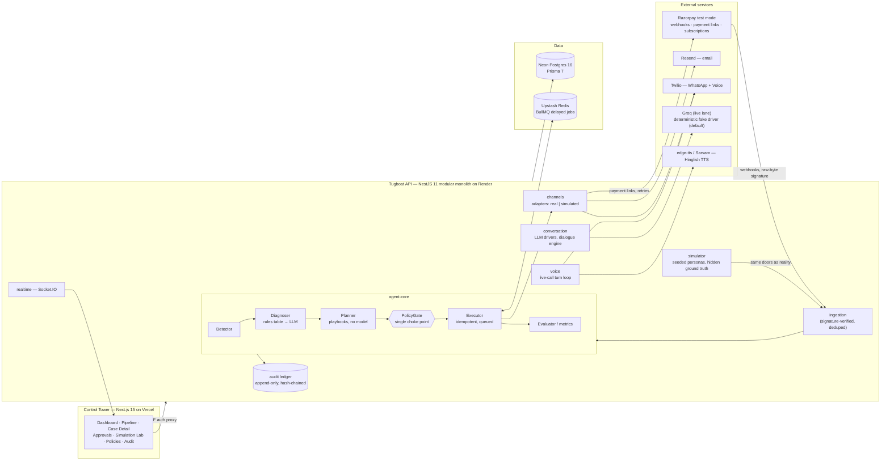

# TUGBOAT — System Architecture

**As-built architecture for the Razorpay AI Buildathon, Track 03 (AI Revenue Recovery).**
This document describes the system that runs today — not a plan. Nothing below is asserted
that the repo cannot check: the committed evidence report ([evidence/](evidence/)) was
written by the running system; the audit chain re-verifies in the browser (Audit
Explorer → Verify); the test suite is described in §10 and runs with `npm test` /
`npm run test:int`.

---

## 1. The system in one paragraph

Tugboat is an agent that closes the revenue-recovery loop end to end: it **detects**
revenue at risk from Razorpay webhooks and a payment-degradation monitor, **diagnoses**
the root cause (a deterministic rules table first, an LLM only for genuine ambiguity),
**decides** an intervention from per-case-type playbooks, **executes** it through bounded
channel adapters (email, WhatsApp, Hinglish voice, silent retry via live payment links)
with every action passing one PolicyGate, and **measures** the result across a batch —
producing an evidence report whose compliance section is computed from the audit ledger
rather than reported by the agent. The governing sentence of the whole design:

> **The LLM proposes; the state machine and the PolicyGate dispose.**

## 2. System diagram

Deployment topology (as deployed): Control Tower on **Vercel** (root dir `frontend/`),
API on **Render** via the repo's `render.yaml` Blueprint, Postgres on **Neon**, Redis on
**Upstash**. Live at <https://tugboat-six.vercel.app/>; the five-minute walkthrough is at
<https://youtu.be/e0orCEB-_eE>. Auth crosses the two origins through a Next.js BFF proxy
that sets the session cookie first-party on the Vercel domain; the realtime socket
authenticates cross-site with a two-minute token minted server-side. A GitHub Actions
workflow (`.github/workflows/keep-warm.yml`) pings `/healthz` every five minutes so the
free instance keeps its scheduler running (§6). Twilio's webhooks — inbound WhatsApp,
message status, the live-call turn loop — are registered by the adapters from
`PUBLIC_API_URL` and verified by signature before anything is read.

## 3. The agent loop

Five injectable stages, separately testable, composed by the executor's queue:

1. **Detector** — opens cases from normalized events; a rolling z-score monitor on the
   gateway's own success-rate baseline detects payment degradation, with low-volume
   arithmetic worked out deliberately: a sampling-error floor, hysteresis to close an
   incident, and a baseline frozen while one is open. During a degradation incident the
   planner biases toward silent retry — customers are not messaged about the merchant's
   own outage.
2. **Diagnoser** — an ordered, versioned rules table maps known gateway error codes to
   root causes and **returns null rather than guessing**. Only unmatched signals go to
   the LLM, whose output is parsed against a strict Zod schema with exactly one repair
   attempt. Confidence below 0.60, or a schema failure, escalates to a human instead of
   guessing. The Case Detail timeline badges every diagnosis `method: rules-table` or
   `method: LLM`.
3. **Planner** — reads per-case-type playbooks (payment-failed, checkout-abandoned,
   mandate-failed, invoice-overdue) and calls no model.
4. **Executor** — performs actions through channel adapters, entirely via queued jobs
   (§6), never inline with a webhook.
5. **Evaluator / metrics** — grades outcomes; for batches, joins the simulator's hidden
   ground truth only at grading time.

**Case state is a finite state machine.** One explicit transition table; illegal
transitions throw. `recovered` is the only stage with no exits — and the machine may
refuse anything *except* the money arriving: a payment landing on a case in any stage
ends it as recovered. Two more doors are human-shaped: `exhausted → escalated` and
`halted → escalated`, so a merchant can take a case the agent has finished with. The
opt-out is guarded where it lives — the override service refuses to take a case whose
customer said STOP, and the gate refuses every send to them — rather than by walling
off a stage from its owner. A restart is a timestamp the gate counts from, not a
deletion (§4). Every state change and the event describing it are written in one
transaction — the timeline UI literally renders the event log, so there is no second
source of truth to drift. Event sequence numbers are assigned optimistically and
protected by a unique constraint, with the collision retry in a shared helper that every
writer uses — it started life inside one service, and a second writer shipped without it
before the lesson was learned that a fix at a call site is a fix the next call site
doesn't get.

The LLM appears exactly twice in this loop — ambiguous diagnosis, and conducting the
Hinglish dialogue — and in both places it produces *proposals* that deterministic code
validates, gates, and applies. It cannot transition state, send a message, or move money.

## 4. The control plane: PolicyGate, stopping rules, approvals

**One door out.** Every outbound action passes `PolicyGate` — a pure function over
(action, case, policy snapshot) that evaluates **every** check even after one has failed,
so the audit entry carries the full checklist, not a short-circuit. Verdicts are typed as
three kinds of "no" — defer (quiet hours, cool-down), refuse, terminate — with terminal
refusals outranking approvals outranking deferrals. The compile-time enforcement is a
branded `GatePass` type: an ungated send **does not compile**.

Stopping rules, all configurable in the Policies UI, all measured in the evidence report:

| Rule | Bound | Note |
|---|---|---|
| Quiet hours | 21:00–09:00 IST, contact deferred to window open | TRAI DND-aligned; silent retries exempt; fixed IST arithmetic, no timezone library |
| Attempt cap | 4 contacts per case (3 re-presentations for mandates) | only *executed* actions count against a bound — a message the provider later reports as failed hands its attempt back, once per channel; the case closes `exhausted` and the agent sends nothing more, though a merchant may still take it over or restart it from the handover card |
| Cool-down | 20h between contacts | never two nudges in one afternoon; the **one** bound a named human may waive, for a call they are placing themselves — recorded as `CALL_FORCED_BY_HUMAN` naming the waived check. Quiet hours and the opt-out are never on offer |
| Per-channel cap | e.g. max 1 voice call | falls back to the next-cheapest channel |
| Opt-out | STOP/UNSUBSCRIBE/Hindi equivalents → permanent halt, all channels | **cannot be disabled in the UI**; belongs to the customer, not the case — it survives across cases, days, and even a process crash (proven by accident when a test customer's weeks-old STOP halted a brand-new case) |
| Sentiment halt | strongly negative reply → halt + escalate | |
| Confidence floor | diagnosis < 0.60 → escalate, never guess | applied by the Diagnoser, before anything is planned |
| Deadline expiry | past deadline → EXHAUSTED | stale debts are never chased |

Policies are **versioned data, not code**: a save cuts a new version rather than editing
the active one, every audit entry names the version it was checked against, and the
active pack governs cases already in flight.

**Approvals (human-in-the-loop).** Anything that spends money — a discount, a
concession — or trips an escalation gate (high value, hardship or dispute language, B2B
account, weak diagnosis) stops as a real `NEEDS_APPROVAL` action row. Approving is a
*permission*, not a send button: the release travels back through the queue and the gate
still runs at send time — so an approval granted at 23:00 sends at 09:00. The only edit
ever made to an approved draft is substituting the case's real payment link, and a
removed opt-out line is restored rather than argued about. A redelivered release is
skipped by reading the claim before consulting the gate, so replayed work cannot
reschedule itself.

**Five gates, and every escalation asks a question.** The four gates above ask *before*
an action. The fifth, `escalated_to_human`, is asked after a case has already stopped
with a person — taken from the Control Tower, escalated by the diagnoser under the
confidence floor, or escalated by the executor for a reason no gate covers (a broken
promise, a channel that would not deliver). Its card asks the plainest question in the
product — *carry on, or stand down* — and has three answers: **yes** lifts the hold and
sends the next written rung inside the same caps; **no** halts the case with the reason
on the chain; **restart** approves and stamps `cases.restartedAt`, from which the gate
counts every bound it derives from past sends (channel caps, cool-down, mandate
re-presentations) — nothing is deleted, the timeline keeps every message, and an
opt-out survives a restart. Lifting a hold is itself an act, so approving a handover
writes `AGENT_RESUMED_BY_HUMAN` in the same transaction that clears `pausedAt`; an
answered handover can be asked again when the case falls back to `escalated`, because a
question a human already answered is live again the moment nobody is acting on it. The
Approvals queue is therefore the complete list of what the agent is waiting on a person
for — a property it did not have until a merchant using his own product found three of
his cases sitting in `escalated` over an empty page.

**"Ask Boa to call now" asks the gate first.** The dialog behind it is a dry run of the
identical `evaluateGate` the Executor will run, listing every bound currently objecting
and whether a human may spend it. A cool-down is offered as waivable — it exists to pace
an *unattended* agent, and a merchant looking at one case is the judgement it stood in
for. Everything else is shown as a refusal with no way through. On "Call anyway" the
gate re-runs with an `override` naming the merchant; the cool-down step becomes a
recorded `skip` rather than a dropped check, so the compliance log shows that the bound
was evaluated, objected, and was overridden by a named person.

## 5. Data, audit, and idempotency

**Money is integer paise end to end.** Cases are event-sourced with a materialized
current-state projection: `case_events` is append-only and powers the timeline; the
`cases` row carries derived state updated in the same transaction.

**The audit ledger is tamper-evident three ways:**

1. **Hash chain** — each row's digest covers the previous hash and a canonical payload;
   the preimage is *derived from the row* and re-derived to verify, one chain per case
   plus one for the policy pack. "Verify chain" in the Audit Explorer recomputes it in
   the browser.
2. **Database trigger** — `BEFORE UPDATE OR DELETE` raises on every row, blocking the
   whole class of writes the application could perform. The one bypass is a named
   session variable; an architecture test asserts it appears nowhere under `src/`.
3. **Role separation** — *not yet live*: Neon's free tier provisions a single role. The
   exact `CREATE ROLE`/`REVOKE`/`GRANT` SQL is committed at
   `backend/prisma/sql/audit-ledger-grants.sql` for deployment. Stated plainly because a
   claim that doesn't survive one follow-up question is worth less than the gap.

Ledger writing is not event-subscribed — it is *part of writing an event*, so a ledger
row cannot be missed by a dropped message. Payloads are decision records with PII masked
before storage; the masked-path list is derived from the values themselves, and the
evidence report counts rows where the two disagree. Even the seed writes through the
real writer.

**Idempotency everywhere money or messages move:** webhook dedupe claims the event id
*before* the work — as a five-minute lease, because a null check cannot distinguish "the
previous attempt crashed" from "the previous attempt is still running"; the action row is
claimed with a lease before the send; and every queued step carries the attempt count it
was scheduled against, so a redelivered job that is stale against the case refuses to
run. That last guard exists because testing proved the idempotency key alone stops a
duplicate *message* but not a duplicate *attempt* — a replayed job that re-plans sends
under a legitimately different key, and only the attempt guard catches it.

**Delivery is the provider's verdict, not the acknowledgement.** Twilio answers "queued"
synchronously and decides later. The WhatsApp adapter registers a status callback, and a
signature-verified webhook feeds the later verdict back: a `failed` or `undelivered`
message marks its action `FAILED`, appends a `DELIVERY_FAILED` node — the send happened,
the delivery did not, and both belong on an append-only timeline — and hands the attempt
back to the case, once per channel, so a dead number cannot refund for ever. The refund
also replaces the follow-up job, because that job carries the attempt count it was
scheduled against and would otherwise wait behind a guard that can never match again.
The callback is only registered when `PUBLIC_API_URL` is publicly reachable: Twilio
rejects a message whose callback it could never reach (error 21609) *before* sending it,
so on a laptop without a tunnel the callback that was added to record failed deliveries
was, for one evening, the reason nothing was delivered.

## 6. Time is a first-class citizen

Recovery is a scheduling problem: "retry when the bank recovers", "follow up at 09:00",
"re-present on day 3", "check the promise on the promised date". All of it is **BullMQ
delayed jobs** — no polling loops. Three properties keep that honest:

- **Re-validation before action:** a job re-reads case state and re-runs the gate when it
  fires, because the world may have changed since scheduling — the payment may have
  arrived, the customer may have opted out.
- **The queue is a promise the database made, and a reconciler keeps it:** queued work is
  derivable from rows, so a lost job is restored. A job may reschedule its own id, and
  the queue holds that request until the job has finished — a semantics detail that only
  surfaced against production BullMQ's job locks.
- **The scheduler needs a running host.** Render's free instance sleeps after 15 idle
  minutes and a sleeping instance runs no worker — the first live 09:00 WhatsApp went out
  at 09:44 because nothing had woken the process since 01:45. The mitigation is
  operational — `.github/workflows/keep-warm.yml` pings `/healthz` every five minutes —
  and documented in the README rather than hidden; for a judging window an always-on
  instance is the surer choice.
- **A promise is scheduled from the customer's words.** The promise check-in fires on
  the day the customer named on the call, with a twelve-hour floor so a promise for
  tonight is not chased while the customer is still on the phone. Every deferral lands
  on the same 09:00 boundary, which is why the executor checks for a call already in
  progress to the same handset before dialling.

For batches, simulated time is an async-context clock offset — not a global, not a
stub — starting at a fixed instant so a seed reproduces. The characteristic failure of a
virtual clock — code that *writes* time by default keeps the wall clock — was hit once
(a database-default timestamp left the simulated merchant unable to see any approval as
due) and then audited across the schema.

## 7. Channels: real by configuration, honest by construction

All channels implement one adapter interface with `real` and `simulated` implementations
chosen by config. Three rules keep the lanes honest:

- A lane that says `real` without its key **refuses to boot** rather than silently
  simulating.
- A **batch case is worked by simulated adapters whatever the lanes say** — a synthetic
  customer can never reach Resend, Twilio, or Razorpay.
- Every simulated event is labelled "Simulated" on the timeline. Honesty about
  simulation, with the production path documented, is a feature.

Specifics: one Razorpay payment link per case, issued by the first channel that needs it
and reused by every later one; the "silent retry" is a live payment link whose capture
arrives by webhook — a success that names a case *is* the recovery; test mode is enforced
in code and no provider SDK is imported; every message ends with the opt-out line,
asserted for every body the copy module can produce (102 of the 519 tests in
`message-copy.spec.ts`); WhatsApp replies from a real phone reach the case through
Twilio's inbound webhook, and Twilio's later verdict on an outbound message reaches it
through the status webhook (§5).

**The Hinglish voice call** is the most regulated action in the product, so it is layered:

- *Simulated (default, and always for batches):* the dialogue engine converses with a
  persona; the recording is real audio, rendered server-side by TTS (Edge neural voices
  with no key, or Sarvam Bulbul v3 with one — v1 and v2 were retired under the product
  inside a week, which is why the model id is one exported constant) and stitched into
  one file, served through the Control Tower's own origin.
- *Real (`CHANNEL_MODE_VOICE=real`):* Twilio dials, plays Boa's lines, listens in
  `hi-IN`, and the same dialogue engine answers turn by turn over webhooks until a date
  is agreed, hardship is declared, or the customer hangs up; the two-way recording and
  transcript land on the case, and the customer's turns are what speech recognition
  heard, garbles included. "Ask Boa to call now" queues the rung — the gate still
  decides (§4). The live call has its own single-shape prompt, and the turn endpoint fails
  *politely in Hinglish* rather than letting the provider read an application error into
  the customer's ear — a lesson from the first real call the product ever placed. The
  promise date on the card is the day the customer actually named, resolved by the model
  against a supplied `Today`, not the horizon the agent offered before dialling; and the
  link Boa says she *is sending* is queued through the ordinary gated path the moment the
  promise is recorded — so it can be deferred to 09:00, but it is never unfenced. A guard
  defers a second call to the same phone within minutes of an active one, because
  quiet-hours deferrals all land on the same 09:00 boundary.

## 8. The LLM layer

One driver interface, per-purpose routing, provider named nowhere in business logic. The
live lane runs on Groq (a Gemini driver sits behind the same interface for the reasoning
purposes when its key is present); the **default lane is a deterministic offline fake driver** — not
a test double, a first-class lane — so the entire loop, batch, and report run at zero
cost with no keys. Every output is schema-parsed with one repair attempt; an unreachable
model is handled exactly like one that talks nonsense — a design that was proven live
when the provider retired a model out from under the system and the outage path did
exactly what it was written to do. Every call is metered (tokens, model, paise) against
its case; the report prints actual spend and projected production cost. Model risk is
bounded by placement: the seed-42 batch made **193 LLM calls for 214 cases**, because
the rules table answers first.

## 9. The simulator and the evidence harness

The measurement is designed against the fatal question — *"you graded yourself on a
simulation you wrote."*

- The simulator **enters through the doors reality uses** — the ingestion endpoint and
  the channel adapters; agent code has no import path to personas or ground truth, which
  is joined only at grading time.
- Personas are drawn **disposition-first**, with every trait conditioned on it, and every
  simulated outcome is seeded from the persona — never from a database id — which is what
  makes *same seed, same report* true. The reproducibility claim excludes database
  identities and says so in its own shape.
- **One arm is executed and two are counterfactuals, and the report says which.**
  Baseline (agent off) and naive (contact everything, no bounds) are computed over the
  identical seeded population — same people, same balances, same complaint thresholds.
- **Compliance is counted from the rows the agent wrote while working** — actions and
  ledger — not from the agent's claims, and an integration test plants a quiet-hours
  violation to prove the report would catch one. A compliance section that could only
  ever say yes would say nothing.
- Every closed case is attributed to **exactly one** stopping rule in a stated
  precedence — added after a draft report claimed more endings than the batch had
  cases. The exceptions list carries every unrecovered case with its reason.
- A finished run becomes the demo dataset only when explicitly promoted, and promotion
  clears earlier batches — never a live case.

The harness gets the same scrutiny as the agent. Three simulator defects found late — a
baseline the executed arm could not match by construction, a frozen-clock watermark that
silently discarded every simulated customer reply, and opt-outs leaking between runs of
one seed — moved the committed headline; the artifact was regenerated and the earlier
figures are kept alongside it (see [evidence/README.md](evidence/README.md)). A
measurement wrong in the *unflattering* direction was treated as the same defect as one
wrong in the flattering direction.

**Committed evidence (seed 42, 214 cases, 10 simulated days, policy v15):** ₹11,15,724
recovered of ₹23,95,944 at risk (46.6%) vs a 13.5% no-agent baseline — **+33.0 points**;
the naive arm recovers 2.6 points more by sending 1,004 contacts vs Tugboat's 398, with
501 quiet-hour violations vs zero and 3× the complaints. Diagnosis 90.3% vs hidden
ground truth (rules 93.8%, LLM 57.9% on the 19 hardest); 53 escalations, all decided;
compliance assertions all held, computed from 3,088 ledger entries; ~1 paisa spent per
₹100 recovered. Full report: [evidence/](evidence/).

## 10. Testing strategy

Three tiers with different contracts:

| Tier | Size | Contract |
|---|---|---|
| Unit + e2e (hermetic) | 1,222 + 51 | No `.env`, no connections, nothing dials out. E2E substitutes an in-memory Prisma. |
| Integration | 9 suites, 59 tests | Real Neon + real Redis; concurrency races, redelivery, quiet hours, ledger triggers, batch reproducibility. |
| Live probes | scripted | Real channels and a real browser against the running system; several bugs only these found. |

Two documentation guards run as code: `npm run check:decisions` verifies that every
`Implemented at:` reference in the decision log points at code that exists, and a unit
test fails on any decision or build-note number cited in a comment that has no entry —
because a reference nobody checks is a comment, and a comment that cites nothing reads
as authority.

The browser tier earns its place. A whole family of defects survived every layer below
it because every layer below it was correct: the Case Detail override buttons did
nothing when pressed in the 1.35 seconds between paint and hydration — the route, the
gate and the ledger all worked when called directly; an `sr-only` label escaped a scroll
container and dragged the whole document 1,247px wide on a phone; the Simulation Lab's
configuration panel existed and no phase of the page could reach it; a "Chain verified"
badge on the Case Detail page was a 900 ms timer; and the page derived "on hold" from a
ledger fold after one state change had stopped writing a row. The shared shape — *the
interface asserts something the code beneath it does not do* — is now guarded three
ways: browser checks (a button is disabled before hydration and works on the first
click after it; eight routes at three viewport widths never exceed the viewport), a
verification button that computes or does not exist, and override buttons that read
the same two columns the API guards on.

Two philosophies, learned the hard way and now enforced deliberately:

- **A fake may be crude, never plausible.** A structurally-wrong fake fails loudly at its
  own line; a plausible one returns schema-valid wrong answers that surface a stage later
  as a strange number in a report.
- **Assert on outcomes under contention, not happy-path returns.** The tests that caught
  the worst bugs asserted "exactly one case exists" and "the population is alive," not
  "the call returned 200."

## 11. Architecture decision records (as-built)

- **ADR-1 — Modular monolith, not microservices.** One NestJS deployable, 19 modules
  with DI-enforced seams. A solo, demo-critical build gets zero benefit and enormous
  risk from distribution; the seams are the honest answer to "how does this scale."
- **ADR-2 — Immutable events; state as a projection.** An append-only event table powers
  the timeline UI directly; the case row carries derived state updated in the same
  transaction. Audit and replayability come free.
- **ADR-3 — Explicit FSM; the LLM never transitions state.** One transition table,
  illegal transitions throw — with two refinements, both human or money shaped. Any
  stage may end in `recovered` when the money arrives, and a case the agent has
  finished with — `exhausted` at its attempt cap, or `halted` — may still be taken by a
  person (`→ escalated`). `halted` got that door late, once it was clear that a refused
  delivery and a merchant's own "resolved elsewhere" land there beside opt-outs; the
  opt-out itself is guarded at the override and at the gate, not by the stage. The
  override checks the machine *before* writing the row that describes the move, because
  a 200 that wrote "a human took this case" over an unmoved stage was the worse bug.
- **ADR-4 — Five-stage pipeline as injectable services.** Each stage independently
  testable and independently explainable.
- **ADR-5 — Deterministic-first diagnosis.** A versioned rules table answers known
  codes; the LLM sees only the residue. Now *measured*: rules 93.8% accurate, model lane
  57.9% on the genuinely ambiguous residue, and 18 low-confidence abstentions escalated
  rather than guessed in the committed batch.
- **ADR-6 — Single PolicyGate choke point.** Bounded-and-compliant is only provable with
  exactly one door out; strengthened with pure-function checks, always-full checklists,
  and a compile-time gate-pass type. A human's requested call, the link promised on a
  call, and a handover's release all travel through the same door; the one bound a
  named human may waive is the cool-down, and the waiver is itself a ledger row.
- **ADR-7 — Time as delayed jobs, with re-validation before action.** Plus a reconciler:
  the queue is a promise the database made.
- **ADR-8 — Idempotency everywhere.** Leases instead of null checks; a staleness guard on
  every queued step, not just a key on every send.
- **ADR-9 — Hash-chained append-only ledger.** Chain + database trigger live today; role
  separation is committed deployment SQL, pending a second database role. Honest status,
  not a claim.
- **ADR-10 — Simulator behind reality's interfaces, ground truth hidden.** Refined into
  the one-executed-arm/two-counterfactuals design with the report labelling which is
  which — more honest than pretending three arms ran.
- **ADR-11 — Cost metering first-class.** Actual spend and projected production cost per
  case and per ₹100 recovered.
- **ADR-12 — Policies as versioned data.** Every action's audit entry names its policy
  version; simulation runs pin a snapshot.

## 12. Known limitations, stated plainly

- **Single-tenant by design** for the buildathon; `merchantId` runs through the case
  model, so multi-tenancy is a migration, not a rewrite.
- **The batch is synthetic.** Tugboat has no production merchants; the report says so on
  its face. Baseline and naive arms are modelled counterfactuals, and the modelling
  assumptions that decide the headline are named constants in the simulator.
- **Free-tier constraints are real:** Render sleep stops the scheduler without a
  keep-warm ping; audit role separation awaits a second database role.
- **The model lane is the weakest diagnostic** (57.9% on ambiguous cases) — which is the
  argument for the architecture that confines it, and it is reported, not hidden.
- **Residual nondeterminism** in reruns is limited to database identities; the
  reproducibility test normalizes them and asserts everything else is identical.
- **Delivery verdicts need a public API.** On a laptop without a tunnel the WhatsApp
  status callback is not registered, and the timeline keeps Twilio's optimistic
  "queued" — honest about being unverified, but unverified.
- **A restart narrows one number.** After "Restart the case", `attemptsUsed` counts the
  current run rather than the customer's lifetime contact; the timeline and the ledger
  keep every message ever sent, and the decision row names who reset the counters.
- **Cases escalated before the handover gate existed have no card** until
  `scripts/raise-missing-handovers.mjs` gives them one; the fix lets the question be
  asked again, it does not ask it retroactively.

## 13. What broke at 2 AM, and how it was fixed

The build log runs to ninety-two numbered entries — each with the first wrong theory,
the actual cause, the fix and what guards it now — and the decision log to a hundred and
sixty. These are the breakages that changed the architecture above, in the order they
were found. Several were found at hours the timestamps admit to.

| What broke | Actual cause | Fix, and what guards it now |
|---|---|---|
| **The production queue had never run a single step.** Six stages of green tests; the first sweep against real Redis threw `Custom Id cannot contain :`, and the executor's defer path failed on "locked by another worker". | BullMQ refuses custom ids with more than three colon-separated parts (`case:<id>:step:<n>` has four) and will not let a job cancel and re-queue its own id while it holds the lock. The in-memory queue quietly did the right thing for both. | The adapter spells ids for the wire and reads them back; a self-reschedule is applied on the job's `completed` event; a reconciler re-derives every owed job from the database; a supervisor replaces a worker that wedges after a broker outage. `queue.int-spec.ts` runs the executor's exact call sequence against real Redis. |
| **The idempotency key stopped a duplicate message but not a duplicate attempt.** | A replayed job re-plans and sends the *next* rung under a legitimately different key. | Every queued step carries the attempt count it was scheduled against and refuses to run when stale (§5). |
| **The simulated merchant never answered a single request** — twelve pending, zero decisions, no error. | `requestedAt` was `@default(now())` — the wall clock — under a virtual clock working ten days in the past; nothing was ever old enough to answer. | The runner stamps narrated time; every `@default(now())` on a row the agent writes was audited, and the one left alone (`Action.createdAt`, the lease) is documented as a question about real elapsed time. |
| **A fifth of the batch was misdiagnosed by construction** — 72% accuracy that nobody questioned because it was unflattering. | The generator's "ambiguous" codes carried `GATEWAY_ERROR`, which the rules table reads confidently; the agent was marked down for the harness's mistake. | `population.spec.ts` runs the real `applyRules` over every generated code and asserts the lane labels are true. |
| **Three simulator defects moved the headline** from 36.4% to 46.6%. | A baseline the executed arm could not match by construction; a frozen-clock watermark that discarded every simulated reply; opt-outs leaking between runs of one seed. | The executed arm honours `wouldSelfRecover`; the watermark follows the tick; contacts are run-scoped while the persona's seed is not. The earlier figures are kept beside the new ones. |
| **Bugs that only existed at night.** Twenty-nine integration tests failed after 21:00; the activity feed stamped 00:00–01:00 as `24:xx:xx`. | The gate was correctly deferring every send into quiet hours; `hour12: false` under `en-IN` resolves to the h24 cycle. | The integration tier pins itself to daytime; `hourCycle: "h23"` names the cycle that has a zero. |
| **Every Control Tower figure summed every batch ever run** — 1,528 cases at 19% against 214 at 36%. | Operational queries had no scope; the mock layer had never needed one. | One `where` fragment — live cases plus the promoted batch — spelled once and used everywhere; the ledger is deliberately not scoped. |
| **A batch on the deployed API would have sent 214 synthetic customers through Resend, Twilio and Razorpay,** and promoting it would have deleted the owner's real cases. | Adapters were chosen once at boot by lane; `NOT { simRunId }` matches null. Both found by reading, not running. | `adapterFor` picks by the case's `simRunId`; promotion clears rows with `simRunId: { not: null }` only. |
| **The Razorpay lane said "real" and issued the simulated link.** | A union type in a constructor compiles to `Object`; Nest injected `null` without a word and `mode` fell back to simulated under a real label. | `@Inject(RazorpayClient)` names the token; the spec resolves the service through the real injector and asserts `mode === "real"`. |
| **Providers retired models overnight, three times.** Groq removed the default Llama model; Sarvam retired `bulbul:v1`, then `v2` and its voices. | A provider's vocabulary is not ours to pin. | Model ids are config with one exported constant each; an unreachable model escalates the case (proven live, §8); a TTS failure costs a recording, never a case. |
| **The 09:00 WhatsApp went out at 09:44.** | Render's free instance sleeps after fifteen idle minutes and a sleeping instance runs no scheduler; the last request had been at 01:45. | `.github/workflows/keep-warm.yml` pings `/healthz` every five minutes; the README states the free tier's cost (§6). |
| **The first two real calls dialled one phone twice in the same second.** | Every quiet-hours deferral lands on 09:00:00; the gate's caps are per case, the phone is per person. | One query for a call already in progress to that number; the second rung waits ninety seconds. |
| **The first answered real call ended with Twilio reading "an application error has occurred".** | The model answered the live turn in the *scripted* dialogue's JSON shape because one shared prompt showed two schemas; the turn webhook let the parse failure become a 500. | The live call has its own single-shape prompt; the turn endpoint closes the call politely in Hinglish, records the transcript and logs the cause (§7). |
| **"The button does nothing" — five reports, five causes.** | A click in the 1.35 s before hydration; a transition silently skipped after the ledger row was written, with a 200; an unreachable configure phase; a "Chain verified" badge on a 900 ms timer; a hold derived from a fold that one code path had stopped feeding. | Controls render disabled until hydrated; the machine is checked before the row is written; the dead button became a link to the next action; the panel recomputes every digest; the buttons read the two columns the API guards on (§10). |
| **Boa promised a WhatsApp she never sent, filed a date nobody agreed to, and the timeline said "delivered" for messages Twilio had been failing for days.** | `promiseDate = now + 3 days` computed before the call; a script line nothing honoured; Twilio's synchronous "queued" recorded as delivery, with the dead send burning an attempt. | `promise_date` from the customer's words against a supplied `Today`; the promised link queued through the gate; a status callback feeds Twilio's verdict back and hands the attempt back once per channel (§5, §7). |
| **One missing backslash threw away every promise on every call.** | `/^d{4}-d{2}-d{2}$/` matches `dddd-dd-dd`; the schema refused every real date and the graceful close read "line mein kuch dikkat" to a customer who had just agreed to pay. | The escapes, and eleven tests that send real ISO dates through the schema. A regex is a program with no compiler and no test unless you write one. |
| **The Approvals queue was empty while the merchant's own cases waited on him.** | Escalations with no gate raised no card, by a design measured against batch traffic where the gap was a rounding error. | The fifth gate; every path into `escalated` raises a card; an answered handover can be asked again; `raise-missing-handovers.mjs` backfills the rest (§4). |
| **The WhatsApp status callback killed the message on a laptop with no tunnel.** | Twilio validates `StatusCallback` when it accepts the message and refuses one it could never reach (error 21609). | The callback is registered only when `PUBLIC_API_URL` is publicly reachable; otherwise the message goes out and the status stays honestly at "queued" (§5). |

## 14. Where to look next

| | |
|---|---|
| [evidence/README.md](evidence/README.md) | What the committed numbers describe, and how to reproduce them |
| <https://youtu.be/e0orCEB-_eE> | The five-minute walkthrough of the deployed product |
| [../frontend/README.md](../frontend/README.md) | The Control Tower, page by page |
| [../backend/.env.example](../backend/.env.example) | Every variable, every lane, what switching it on changes |
| [../render.yaml](../render.yaml) | The deployment, as a Blueprint |
| [../.github/workflows/keep-warm.yml](../.github/workflows/keep-warm.yml) | What keeps the free instance's scheduler awake |
| [../scripts/](../scripts/) | `demo.mjs`, `seed-live-case.mjs`, `raise-missing-handovers.mjs`, `check-decisions.mjs`, `evidence-pdf.mjs` |
